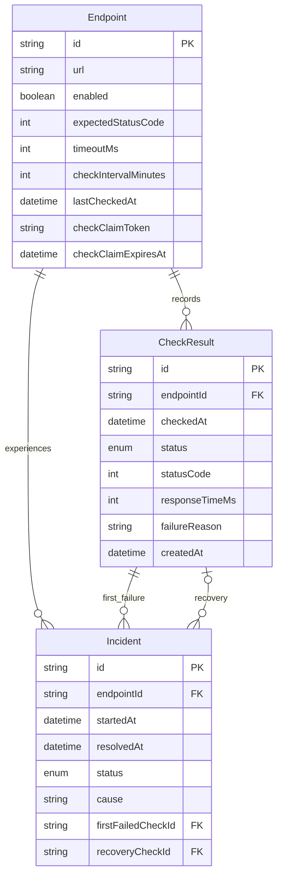
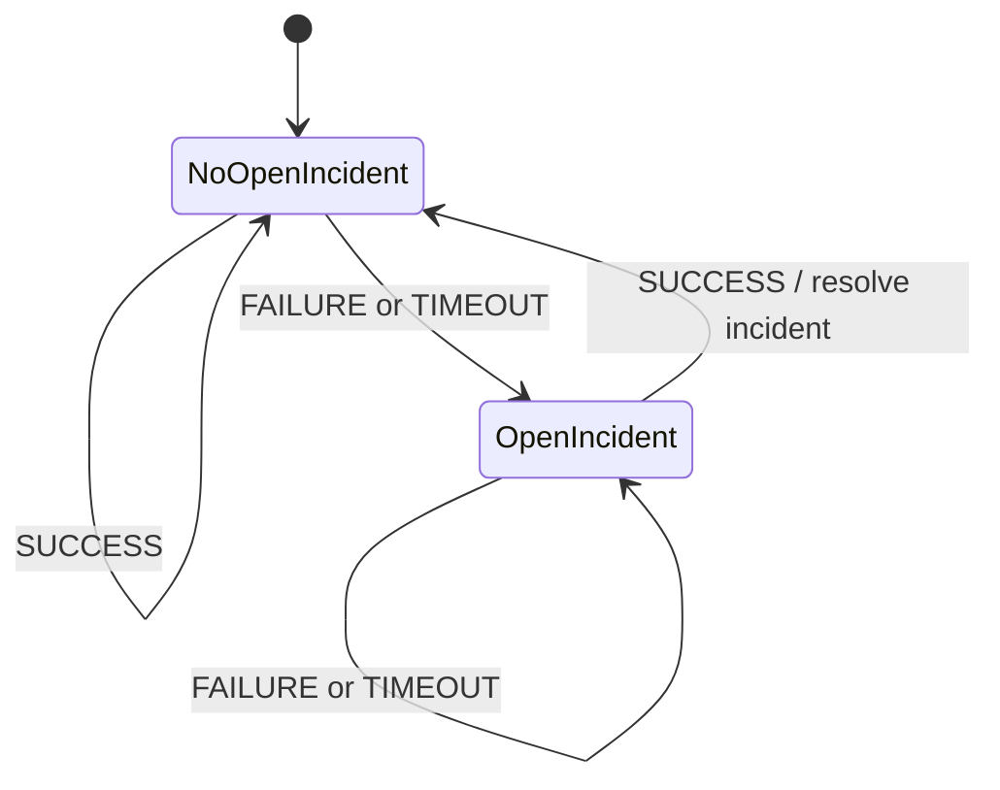

# Architecture

This document describes the implemented system. Phase 0 is the original proposal, not the current concurrency contract.

Editable source: [architecture.mmd](diagrams/architecture.mmd). Regenerate diagrams with `node scripts/render-diagrams.mjs`; this documentation-only command uses Playwright and a pinned Mermaid module from its public CDN. It does not change the app or contact a database.

## Boundaries

| Layer | Responsibility | Main implementation |
| --- | --- | --- |
| Pages and components | Navigation, forms, saved observations, charts | `app/`, `components/` |
| Entry points | Validate inputs, enforce deployment mode, call services | `app/endpoints/actions.ts`, `app/api/cron/checks/route.ts`, `proxy.ts` |
| Scheduler | Claim a bounded due batch and run concurrent checks | `server/monitoring/scheduler.ts`, `check-claims.ts` |
| HTTP engine | URL/DNS validation, pinned transport, deadline, outcome evaluation | `server/monitoring/execute-http-check.ts`, `ssrf.ts`, `pinned-dispatcher.ts` |
| Persistence and incidents | Serialize lifecycle changes and fence stale owners | `server/monitoring/persist-check-result.ts`, `server/incidents/` |
| Read services | Snapshot health, full-window aggregates, bounded history | `server/dashboard/`, `server/endpoint-detail/` |
| Database | Durable facts, relationships, constraints, leases | `prisma/schema.prisma`, `prisma/migrations/` |

## Data Model

Claim fields, last-check timestamps, HTTP status/timing, and recovery references can be null. Health and uptime are derived, not separately persisted. Indexes support due lookup, endpoint/time history, and open incidents. SQL migrations also enforce one open incident per endpoint and consistent resolution fields; the Prisma schema alone is not the complete contract.

## A Scheduled Check

Editable source: [monitoring-lifecycle.mmd](diagrams/monitoring-lifecycle.mmd).

1. One SQL statement selects enabled, due, unleased rows using `FOR UPDATE SKIP LOCKED`, then assigns a token and expiry. Claiming does not alter `lastCheckedAt`.
2. The worker reloads the endpoint and validates that its lease is current before executing its current settings.
3. HTTP runs outside a database transaction. The deadline includes DNS validation; every resolved address must be public, and the chosen address is pinned while preserving the original hostname for HTTPS verification. Redirects are not followed.
4. The result transaction locks the endpoint row, then verifies the lease again. Disabled, expired, or replaced scheduled owners cannot persist.
5. The transaction inserts the check, preserves a monotonic `lastCheckedAt`, and applies incident policy only if the inserted result is the latest by `checkedAt`, `createdAt`, then `id`.
6. The transaction clears its owned claim and commits. Result, timestamp, and incident changes roll back together on internal failure.

Manual trusted-local checks use the same HTTP and persistence logic but do not require a scheduler lease. They still serialize incident updates. Settings changes invalidate claims; they cannot prevent a request already in flight, but they prevent its stale scheduled result from committing.

## Incident Policy

These transitions apply to the latest eligible observation only. The first cause and failed-check reference are retained while an incident remains open. Recovery records its timestamp and check reference. A subsequent failure creates another incident. Disabling monitoring preserves history and any open incident; it is not evidence of recovery.

## Guarantees And Limits

- **No exactly-once claim:** an expiring lease coordinates work, not the remote server. Crashes, expiration, or trusted manual commands can create repeated HTTP attempts.
- **No long network transaction:** row locks are held while saving results, not while waiting for targets.
- **Bounded local concurrency:** batch 20, five concurrent HTTP checks, timeout at most 30 seconds. This is per invocation, not a global quota across every caller.
- **Observation ordering:** late history cannot overwrite newer incident state. Equal timestamps use deterministic tie-breakers; a sampled timestamp is not proof of continuous availability.
- **Internal errors stay internal:** a database write failure increments scheduler errors and is logged in redacted form; it is not inserted as a fabricated target failure.
- **Public restrictions are enforced:** Vercel is read-only at proxy, action, and service boundaries. Reads and claims are scoped to three IDs; HTTP is scoped to their HTTPS origin and paths.
- **Bounded database waits:** client/pool and PostgreSQL deadlines bound connect, query, lock, and idle transaction waits. Production poolers inherit server deadlines from the database role, verified using fresh pooled connections.

## Read Semantics

Health first checks whether monitoring is disabled, then whether an observation exists. Future/invalid timestamps are unknown; an observation older than two configured intervals is stale. Fresh success is up, fresh failure/timeout is down. Incident counts are independent and can include disabled endpoints.

Uptime uses every completed check in the selected rolling window. Average response includes received HTTP responses even when their status is unexpected; response-less failures/timeouts are excluded. Charts are capped at 200 actual observations, recent status bars at 12, and history pages at 25. A period change or refresh never causes HTTP monitoring.

## Scaling Path

Measure scheduler duration, due backlog, database pool pressure, and history-query cost before changing architecture. If a bounded serverless batch no longer drains due work, move execution to dedicated workers with a durable queue, idempotent job identities, and a global concurrency budget. Keep the transaction/incident invariants. Add retention and pre-aggregated metrics as history grows; consider partitioning only when measured query/storage costs warrant it. Multi-region probes need explicit aggregation/quorum rules, independent infrastructure, and a revised incident model.

These are future changes, not implemented capabilities.

## Implementation History

- [Phase 0: Original proposal](phase-0-architecture.md)
- [Phase 1: Foundation](phase-1-foundation.md)
- [Phase 2: HTTP monitoring](phase-2-monitoring.md)
- [Phase 3: Incidents](phase-3-incidents.md)
- [Phase 4: Scheduling](phase-4-scheduling.md)
- [Phase 5: Endpoint management](phase-5-endpoint-management.md)
- [Phase 6: Dashboard](phase-6-dashboard.md)
- [Phase 7: Endpoint detail](phase-7-endpoint-detail.md)
- [Phase 8: Hardening](phase-8-hardening.md)
- [Phase 9: Deployment](phase-9-deployment.md)
- [Phase 10: Portfolio presentation](phase-10-portfolio.md)
